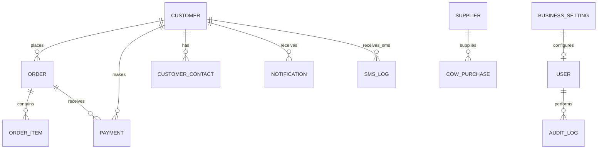

# Vendora — Complete Product & Technical Specification

## 1. Product Overview

Vendora is a business operations platform for meat and livestock supply businesses. It is designed for owners, managers, and admin staff who need to track customers, orders, outstanding balances, supplier purchases, and payment collections in one place.

### Problem statement

Many small and medium meat businesses still manage operations across WhatsApp, paper ledgers, cash books, and spreadsheets. This leads to:

- duplicated customer records
- missed payment reminders
- poor visibility into outstanding balances
- unclear order status tracking
- no standardized livestock procurement tracking
- difficulty reconciling business cash flow

### Target users

- business owner
- operations manager
- sales/admin staff
- finance clerk
- supplier liaison
- customers or clients with limited portal access

### Business model and use case

Vendora helps a meat supply business manage the entire lifecycle from customer order to payment collection and cow procurement. The platform is not a consumer storefront. It is a business dashboard and operational system built to keep the company financially organized and operationally efficient.

### Goals

- centralize customer information
- track orders and payment status
- monitor outstanding balances
- record livestock purchases and supplier details
- automate payment reminders via SMS
- provide clear business KPIs on the dashboard
- support future client portal access

### Non-goals

- public ecommerce storefront for end consumers
- full ERP for large multinational supply chains
- complex inventory management for unrelated retail products
- B2C shopping experiences as the primary use case

### Success criteria

The first version is successful when a business owner can:

- add and manage customers
- create orders with correct totals and balances
- record payments without losing transaction history
- see which customers owe money
- track cow purchases and supplier costs
- send or schedule overdue payment reminders
- view dashboard summaries for decisions

---

## 2. User Roles & Permissions

### Roles

| Role | Description | Core permissions |
| --- | --- | --- |
| Business Owner | Full operational and financial authority | Full access |
| Admin | Business operations and staff management | Most access, excluding high-risk settings |
| Staff | Order and customer processing | Create/update orders and payments |
| Finance | Payment and balance management | Manage payments, reports, reconciliation |
| Supplier Manager | Procurement and cow purchases | Manage suppliers and purchases |
| Customer / Client | Limited external view | View own order and payment status |
| Auditor | Read-only | View audit logs and reports |

### RBAC permission matrix

| Module | Owner | Admin | Staff | Finance | Supplier Manager | Customer | Auditor |
| --- | --- | --- | --- | --- | --- | --- | --- |
| Dashboard | Full | Full | View | View | View | No | View |
| Customers | Full | Full | CRUD | View | View | Own | View |
| Orders | Full | Full | CRUD | View | View | Own | View |
| Payments | Full | Full | Create | Full | View | Own | View |
| Cow Purchases | Full | Full | View | View | Full | No | View |
| Suppliers | Full | Full | View | View | Full | No | View |
| Reports | Full | Full | View | Full | View | Own | View |
| SMS Reminders | Full | Full | Create | Full | No | No | No |
| Settings | Full | Limited | No | No | No | No | No |
| Audit Logs | Full | Full | No | No | No | No | Full |

---

## 3. Complete Feature Specification

### MVP

#### Authentication
- admin login with email and password
- secure password hashing in production
- session or JWT-based access
- logout and session expiry rules

#### Dashboard
- overview cards for total customers, open orders, payments received, outstanding balances
- recent order list
- outstanding customer list
- quick actions for new order and new customer

#### Customers
- create customer
- update customer profile
- view customer activity
- search and filter by name, phone, location, status
- mark account active/inactive

#### Orders
- create order for a customer or walk-in buyer
- include meat type, quantity, unit price, notes, status
- automatic total amount calculation
- balance calculation based on payments received
- order status tracking

#### Payments
- record payment against an order
- support multiple payment methods
- update outstanding balance automatically
- keep payment history immutable for financial integrity

#### Cow purchases
- track purchase date, seller, number of cows, price, total cost, weight
- record procurement cost by batch
- basic operational reporting

#### Settings
- business name, email, phone, address
- default currency
- reminder threshold days
- invoice prefix

### Phase 2

- customer portal with secure login
- invoice generation
- supplier CRUD and relationship tracking
- transaction adjustments and refunds
- improved analytics and charts
- export reports to CSV/PDF

### Phase 3

- expense tracking and monthly cost reporting
- supplier performance analytics
- cattle sale/resale records and profit tracking
- advanced audit history and approval flows
- role-based approval for financial edits

### Future / optional

- multi-branch support
- WhatsApp integration
- team attendance and payroll
- auto-generated invoices and statements
- advanced forecasting
- AI-based reminder optimization

---

## 4. Complete Business Workflows

### Customer order workflow

```text
Customer created
      ↓
Order created
      ↓
Order confirmed
      ↓
Payment recorded
      ↓
Balance calculated
      ↓
Payment due
      ↓
Reminder sent
      ↓
Payment received
      ↓
Balance updated
```

### Cow purchase workflow

```text
Cow purchased
      ↓
Supplier recorded
      ↓
Purchase cost recorded
      ↓
Cow status tracked
      ↓
Sale/resale recorded
      ↓
Profit calculated
```

### Outstanding debt workflow

```text
Order with balance
      ↓
Reminder threshold reached
      ↓
SMS queued
      ↓
Message sent
      ↓
Payment posted
      ↓
Outstanding reduced
      ↓
Account updated
```

---

## 5. Database Design

### Core entities

- User
- Customer
- CustomerContact
- Order
- OrderItem
- Payment
- CowPurchase
- Supplier
- Expense
- Notification
- SMSLog
- AuditLog
- BusinessSetting

### Entity contract template

For every entity we define:

- Entity
- Purpose
- Fields
- Data types
- Required vs optional
- Relationships
- Indexes
- Constraints

### Recommended entities

#### User
- id
- name
- email
- passwordHash
- role
- isActive
- createdAt
- updatedAt

#### Customer
- id
- name
- contactPerson
- phone
- email
- location
- status
- totalOrders
- totalPaid
- outstandingBalance
- createdAt
- updatedAt

#### CustomerContact
- id
- customerId
- name
- phone
- relationship
- isPrimary

#### Order
- id
- customerId
- customerName
- meatType
- orderDate
- quantity
- unitPrice
- totalAmount
- amountPaid
- balance
- paymentStatus
- orderStatus
- notes
- createdAt
- updatedAt

#### OrderItem
- id
- orderId
- productName
- quantity
- unitPrice
- totalPrice
- notes

#### Payment
- id
- orderId
- customerId
- amount
- method
- paymentDate
- reference
- notes
- createdBy
- createdAt

#### CowPurchase
- id
- supplierId
- purchaseDate
- cowCount
- purchasePricePerCow
- totalCost
- weightKg
- notes
- createdAt

#### Supplier
- id
- name
- phone
- email
- location
- status
- createdAt

#### Expense
- id
- category
- amount
- description
- incurredDate
- vendor
- createdAt

#### Notification
- id
- userId
- customerId
- type
- title
- message
- isRead
- createdAt

#### SMSLog
- id
- customerId
- phone
- template
- status
- providerMessageId
- sentAt
- response

#### AuditLog
- id
- actorId
- entityType
- entityId
- action
- oldValues
- newValues
- createdAt

#### BusinessSetting
- id
- businessName
- businessEmail
- businessPhone
- businessAddress
- defaultCurrency
- reminderThresholdDays
- invoicePrefix

### ERD structure



### Relationship rules

- each customer can have many orders
- each order can have many order items
- each order can have many payments
- each payment belongs to one order and one customer
- each cow purchase belongs to one supplier
- each audit log references the actor and the modified entity
- financial records should be append-only in many cases, not overwritten casually

---

## 6. Financial Logic

Financial integrity is a core requirement for Vendora. We must not allow data to be silently overwritten in a way that destroys the payment history.

### Core equations

```text
Order Total = sum(order items)
Payments Made = sum(all accepted payments for order)
Outstanding Balance = Order Total - Payments Made
```

### Payment states

- unpaid: balance == total
- partially paid: 0 < balance < total
- fully paid: balance == 0
- overpayment: payments > total
- cancelled: order marked cancelled and no further payment processing

### Rules

- payment amounts must be positive
- payment cannot be deleted without audit note
- payment edits should create an adjustment record instead of mutating original data
- balance must be recalculated on payment creation, not hard-coded by a user form alone
- refunds and adjustments require explicit approval and audit log entries
- overpayment should be stored as separate ledger information if supported

### Recommended financial model

- keep original payment records immutable
- derive current balance from ledger entries
- allow positive or negative adjustments with explicit reason codes
- enforce totals on the server, not only on the frontend

---

## 7. API Specification

### Core API conventions

- JSON request/response body
- RESTful routing
- consistent error response format

```json
{
  "success": false,
  "message": "Customer not found",
  "code": "CUSTOMER_NOT_FOUND"
}
```

### Authentication endpoints

| Method | Endpoint | Purpose |
| --- | --- | --- |
| POST | /api/auth/login | Admin login |
| POST | /api/auth/logout | Clear session |
| GET | /api/auth/me | Fetch current user |

### Customer endpoints

| Method | Endpoint | Purpose |
| --- | --- | --- |
| POST | /api/customers | Create customer |
| GET | /api/customers | List customers |
| GET | /api/customers/:id | Fetch one customer |
| PATCH | /api/customers/:id | Update customer |
| DELETE | /api/customers/:id | Delete or archive customer |

### Order endpoints

| Method | Endpoint | Purpose |
| --- | --- | --- |
| POST | /api/orders | Create order |
| GET | /api/orders | List orders |
| GET | /api/orders/:id | Fetch order details |
| PATCH | /api/orders/:id | Update order |
| PATCH | /api/orders/:id/status | Update order status |
| DELETE | /api/orders/:id | Delete or cancel order |

### Payment endpoints

| Method | Endpoint | Purpose |
| --- | --- | --- |
| POST | /api/payments | Record payment |
| GET | /api/payments | List payments |
| GET | /api/payments/:id | Fetch payment |
| GET | /api/orders/:id/payments | Payment history for one order |
| PATCH | /api/payments/:id | Adjust payment |
| DELETE | /api/payments/:id | Reverse or archive payment |

### Cow purchase endpoints

| Method | Endpoint | Purpose |
| --- | --- | --- |
| POST | /api/cow-purchases | Create purchase |
| GET | /api/cow-purchases | List purchases |
| GET | /api/cow-purchases/:id | Fetch purchase |
| PATCH | /api/cow-purchases/:id | Update purchase |
| DELETE | /api/cow-purchases/:id | Delete purchase |

### Supplier endpoints

| Method | Endpoint | Purpose |
| --- | --- | --- |
| POST | /api/suppliers | Add supplier |
| GET | /api/suppliers | List suppliers |
| GET | /api/suppliers/:id | Fetch supplier |
| PATCH | /api/suppliers/:id | Update supplier |
| DELETE | /api/suppliers/:id | Archive supplier |

### Settings endpoints

| Method | Endpoint | Purpose |
| --- | --- | --- |
| GET | /api/settings | Fetch app settings |
| PATCH | /api/settings | Update app settings |

### SMS endpoints

| Method | Endpoint | Purpose |
| --- | --- | --- |
| POST | /api/sms/reminders/send | Send reminder |
| GET | /api/sms/logs | View SMS logs |
| POST | /api/sms/reminders/batch | Trigger queued reminders |

### Report endpoints

| Method | Endpoint | Purpose |
| --- | --- | --- |
| GET | /api/reports/dashboard | KPIs |
| GET | /api/reports/outstanding | Outstanding balances |
| GET | /api/reports/payments | Payment totals |
| GET | /api/reports/profit | Purchase vs sales metrics |

### Endpoint behavior requirements

For each endpoint, we document:

- purpose
- authentication
- permissions
- request validation
- success response
- error response
- side effects
- audit events

---

## 8. Frontend Architecture

### App structure

```text
frontend/
├── src/
│   ├── App.jsx
│   ├── main.jsx
│   ├── index.css
│   ├── assets/
│   ├── Components/
│   │   ├── AdminLayout.jsx
│   │   ├── Navbar.jsx
│   │   ├── ProductCard.jsx
│   │   ├── Footer.jsx
│   │   └── ...
│   ├── context/
│   │   ├── AuthContext.jsx
│   │   ├── CartContext.jsx
│   │   └── ...
│   ├── Pages/
│   │   ├── AdminDashboard.jsx
│   │   ├── AdminCustomers.jsx
│   │   ├── AdminOrders.jsx
│   │   ├── AdminPayments.jsx
│   │   ├── AdminCowPurchases.jsx
│   │   ├── AdminSettings.jsx
│   │   └── AdminLogin.jsx
│   ├── Data/
│   ├── hooks/
│   ├── services/
│   ├── utils/
│   └── styles/
```

### Frontend responsibilities

- admin dashboard UI
- customer and order forms
- payment collection views
- reports and KPI cards
- responsive navigation and layout
- API service layer for backend requests
- toast notifications and validation messages

### Keep vs replace

We keep:
- existing React + Vite structure
- admin shell and layout model
- routing pattern
- general app composition

We replace:
- product-store branding and copy
- retail product logic
- non-business dashboard features
- marketing storefront assumptions

---

## 9. Complete Page / Screenshot Specification

### Dashboard

**Purpose**: operational overview of business health.

**Sections**:
- sidebar navigation
- header with search and business info
- KPI cards
- recent orders
- outstanding customer list
- quick actions

**Data displayed**:
- total customers
- outstanding balances
- payments this month
- orders pending

### Customers

**Purpose**: manage all buyer relationships.

**Features**:
- list all customers
- add new customer
- view customer details
- search by name, phone, location
- mark active or inactive

### Customer detail

**Purpose**: maintain a single profile including all historical business activity.

**Sections**:
- customer identity info
- contact details
- order history
- payment history
- outstanding summary

### Orders

**Purpose**: create and manage customer orders.

**Sections**:
- order table
- filters
- create order modal
- order status badge
- payment status badge

### Payments

**Purpose**: record incoming funds and maintain financial history.

**Sections**:
- payment list
- payment form
- customer lookup
- payment method and reference field

### Cow purchases

**Purpose**: track procurement and supplier cost.

**Sections**:
- purchase list
- add purchase form
- supplier selection
- cost totals

### Settings

**Purpose**: configure business defaults and operational preferences.

**Sections**:
- business profile
- default currency
- reminder threshold
- invoice prefix

### Login

**Purpose**: secure admin access.

**States**:
- idle
- loading
- error
- success redirect to dashboard

---

## 10. Design System

### Brand direction

Vendora should feel:

- professional
- trustworthy
- agricultural and grounded
- modern without looking like a consumer retail app

### Color palette

**Primary** `#12372A`

**Secondary** `#1F6F4A`

**Accent** `#D4A72C`

**Background** `#F8F6EF`

**Surface** `#FFFFFF`

**Text** `#1F2933`

### Typography

- headings: bold geometric modern sans-serif
- body: clean readable sans-serif
- uppercase labels for operational sections

### UI rules

- cards with soft shadows and border separators
- consistent spacing scale
- rounded buttons and input fields
- status badges for payment and order states
- minimal but clear table design

### Responsive breakpoints

- mobile: under 768px
- tablet: 768px–1024px
- desktop: 1024px+

### Accessibility

- color contrast must remain readable
- keyboard navigation for all buttons and forms
- visible focus states
- semantic labels for inputs and tables

---

## 11. Security Specification

### Authentication

- hashed passwords using bcrypt or Argon2 in production
- secure sessions or JWT with expiration
- login attempt limits
- admin-only protected routes

### Authorization

- role-based access control for each page and endpoint
- server-side permission checks, not only frontend hiding
- strict validation on every route

### Data protection

- no secrets in frontend code
- environment variables for database and provider credentials
- CORS restricted to expected origins
- rate limiting on login and public endpoints
- SQL injection prevention via query parameterization

### Audit and incident handling

- record updates to payments, orders, and settings
- log failed admin logins
- keep financial history intact
- avoid exposing sensitive customer or payment data in logs

---

## 12. SMS Architecture

### Flow

```text
Payment overdue
      ↓
Notification service
      ↓
SMS provider
      ↓
Customer
      ↓
SMS delivery status
      ↓
SMSLog
```

### Reminder logic

- send reminder when a payment is overdue
- reminder threshold controlled by business settings
- avoid duplicate reminders within a time window
- queue reminders asynchronously
- record success/failure in SMSLog

### Template examples

- overdue payment reminder
- partial payment notice
- final outstanding reminder
- order confirmation follow-up

### Retry strategy

- retry once or twice with exponential backoff
- mark as failed if provider rejects the number or the message fails
- allow manual resend from admin panel

---

## 13. Background Jobs

Because reminders and reporting should not block API requests, Vendora should use an async worker model.

### Suggested stack

```text
Node/Express
     ↓
Redis / queue system
     ↓
Worker process
     ↓
SMS provider / email provider
```

### Jobs

- overdue reminder scheduler
- daily dashboard summary
- nightly report generation
- customer notification dispatch
- failed message retry queue

---

## 14. Reporting & Analytics

### Business reports

- total sales by period
- outstanding balance by customer
- payments collected
- order volume by meat type
- top customers by revenue
- cow purchase costs vs sales
- profit by batch or month
- supplier payment summary

### Dashboard metrics

- total customers
- active orders
- paid vs outstanding
- average order value
- overdue customers count
- total livestock cost

---

## 15. Error Handling

All APIs should return consistent, predictable errors.

```json
{
  "success": false,
  "message": "Payment amount exceeds remaining balance",
  "code": "PAYMENT_EXCEEDS_ALLOWED_AMOUNT"
}
```

### Error categories

- validation errors
- authorization errors
- not found errors
- conflict errors
- provider errors
- financial integrity errors

---

## 16. Validation Rules

### Customer validation

- name required
- phone format validated
- location optional but recommended
- email validation if provided

### Order validation

- customer or walk-in customer required
- meat type required
- quantity > 0
- unit price >= 0
- total calculated server-side

### Payment validation

- amount > 0
- payment method required
- payment cannot exceed allowed balance unless explicit overpayment is enabled
- payment reference optional but recommended

### Business settings validation

- currency must be valid ISO code
- reminder threshold must be non-negative
- invoice prefix alphanumeric with reasonable length

---

## 17. Testing Strategy

### Unit tests

- calculation helpers
- validation logic
- balance calculation rules
- status transitions

### API tests

- customer create/read/update/delete
- order creation and status updates
- payment posting and ledger logic
- forbidden access cases

### Database tests

- migration validation
- data integrity under transactions
- relation constraints

### Frontend tests

- login behavior
- dashboard rendering
- form validation
- loading and empty states

### End-to-end tests

- admin login
- create customer
- create order
- record payment
- check outstanding balance
- send reminder

### Manual QA checklist

- payment history remains intact after a correction
- order total matches invoice
- mobile nav works
- dashboard metrics reflect real data

---

## 18. Deployment Architecture

```text
React/Vite frontend
      ↓
Hosted on Vercel / Netlify / similar

Node/Express backend
      ↓
Hosted on Render / Railway / VPS
      ↓
PostgreSQL database

Redis / message queue
      ↓
Worker services

SMS provider
```

### Production requirements

- environment variables for secrets
- database migrations run automatically or in CI/CD
- backups for PostgreSQL
- centralized logging and monitoring
- health checks for API and database
- configured CORS and rate limiting

---

## 19. Git & Development Workflow

### Branch strategy

```text
main
├── feature/auth
├── feature/customers
├── feature/orders
├── feature/payments
├── feature/sms
├── feature/reports
└── feature/release
```

### Commit conventions

- feat: add customer management
- fix: correct payment balance calculation
- chore: update project documentation
- refactor: simplify order form state
- test: add payment API validation

### Definition of done

A feature is complete only when:

- backend implemented
- database model updated
- frontend UI complete
- validation implemented
- authorization enforced
- tests written
- documentation updated
- manual verification passed
- commit pushed to branch

---

## 20. Development Roadmap

### Phase 0 — Foundation

- architecture alignment
- database design
- design system
- project documentation

### Phase 1 — Authentication

- login
- roles
- protected routes

### Phase 2 — Customers

- customer CRUD
- profiles
- search/filter

### Phase 3 — Orders

- order creation
- status tracking
- totals and balances

### Phase 4 — Payments

- payment recording
- payments history
- outstanding balance logic

### Phase 5 — Dashboard

- KPI cards
- recent order table
- customer debt summary

### Phase 6 — Cow Purchases

- supplier management
- purchase logs
- procurement reporting

### Phase 7 — SMS reminders

- schedule reminders
- queue processing
- logs and retry logic

### Phase 8 — Client portal

- order visibility
- payment status view
- account access

### Phase 9 — Reports

- operational and financial reporting
- monthly summaries

### Phase 10 — Production hardening

- security review
- deployment prep
- monitoring and backup strategy

---

## 21. Definition of Done

For every feature, we will require:

- database implemented
- backend endpoint implemented
- validation rules implemented
- authorization covered
- frontend implemented
- loading state
- empty state
- error state
- responsive UI
- tests written
- documentation updated
- manual verification completed

---

## 22. Master Feature Checklist

```text
VENDORA
├── Foundation
├── Authentication
├── Users & Roles
├── Customers
├── Orders
├── Payments
├── Cow Purchases
├── Suppliers
├── Expenses
├── SMS
├── Notifications
├── Dashboard
├── Reports
├── Client Portal
├── Settings
├── Security
├── Testing
├── Deployment
├── Documentation
└── Maintenance
```

---

## Project status

This repository currently reflects the Vendora business model concept and is structured to evolve around a business-first admin dashboard for meat supply operations rather than a retail storefront.

## Quick start

### Frontend

```bash
cd frontend
npm install
npm run dev
```

### Backend

```bash
cd backend
npm install
npm run dev
```

## Notes

- frontend connects to the backend at `http://localhost:5000`
- backend is designed for Node.js + Express + Prisma + PostgreSQL
- this project is intentionally business-operations focused rather than consumer e-commerce
